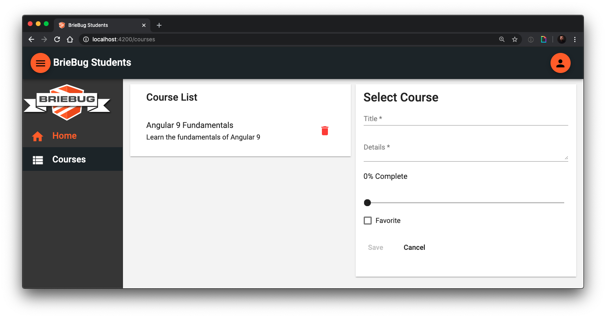

# Angular Fundamentals Course

This is the sample project for the Angular Fundamentals course used at BrieBug Academy. 

It is an application built using Angular, Angular Material, the Angular CLI within an Nx workspace by NRWL.



This app demonstrates how to use fundamental Angular techniques to build a master-detail view application that can consume a RESTful API. This is one of the most common UX patterns in existence and incredibly useful when learning a new framework.

## Prerequisites
- [Git](https://git-scm.com/book/en/v2/Getting-Started-Installing-Git)
- Node.js and NPM – we recommend using [NVM (Linux/Mac)](https://github.com/creationix/nvm) or [NVM-Windows (Windows)](https://github.com/coreybutler/nvm-windows)
- Install Angular CLI via `npm i -g @angular/cli`

### Getting Started

There are two main parts to this application. The first is the RESTful API, for which we are using `json-server`. The second part is the Angular application server which we will start using `ng serve`.  

To get started run the commands below.

```bash
$ git clone https://github.com/briebug/angular-fundamentals-course.git
$ cd angular-fundamentals-course
$ npm install
$ npm run server:all
```

Then navigate to [http://localhost:4200](http://localhost:4200/items) in your browser.

> Note: the above terminal commands are for Mac. Remember to substitute the appropriate commands for your OS.

## Generating Custom Elements
Angular has the ability to turn a component into a standalone custom element and embed that in an HTML document.

Simply run `npm run build:elements` to generate a standalone element. 

This will run an `ng build`, concatenate the resulting scripts into one file, and copy that file to the `site` directory.

Once that script is finished, simply serve the `site` directory.

## Code Scaffolding

Run `ng generate component component-name` to generate a new component. You can also use `ng generate directive/pipe/service/class`.

## Build

Run `ng build` to build the project. The build artifacts will be stored in the `dist/` directory. Use the `-prod` flag for a production build.

## Running Unit Tests

Run `ng test` to execute the unit tests via [Karma](https://karma-runner.github.io).

## Running E2E Tests

Run `ng e2e` to execute the end-to-end tests via [Protractor](http://www.protractortest.org/). 
Before running the tests make sure you are serving the app via `ng serve`.
